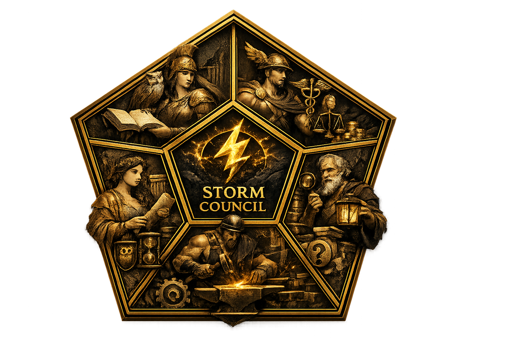

<!-- markdownlint-disable MD033 MD041 -->

<p align="center">
  
</p>

<h1 align="center">Storm Council</h1>

<p align="center">
  <strong>Contradiction-aware research workflow</strong><br>
  <sub>Ask a question — get traceable evidence, competing perspectives, an explicit contradiction ledger, and a decision-ready brief.</sub>
</p>

<p align="center">
  <a href="https://claude.ai/claude-code"></a>
  <a href="LICENSE"></a>
  <a href="skills/storm-council/SKILL.md"></a>
</p>

---

Storm Council takes a question and an intended decision, then runs a six-stage workflow through five independent research lenses. Each lens gathers evidence, makes claims, and cross-examines the others. Agreements and disagreements are recorded explicitly — not smoothed over. The result is a source-mapped synthesis, an argument map, a one-page decision brief, and an adversarial quality gate.

Inspired by [Stanford OVAL's STORM](https://github.com/stanford-oval/storm) — which generates Wikipedia-style articles through simulated persona dialogue — Storm Council takes that multi-perspective idea in a different direction: toward *contested decisions*, with an explicit contradiction ledger and an adversarial quality gate instead of article prose.

It runs as a **Claude Code plugin**: no API key, no separate billing. It uses your own Claude Code session. The methodology, evidence taxonomy, and design rationale are in [`docs/methodology.md`](docs/methodology.md).

---

## ✅ What it does

- **Contradiction-aware by construction.** Parallel answers are not collective reasoning. Storm Council makes perspectives *inspect one another's* claims, and records what they disagree about:
  - every factual claim cites a stable source ID
  - contradictions, tensions, scope differences, and evidence gaps are structured data, not prose
  - confidence and evidence status are explicit fields, not implied tone
  - a quality gate issues PASS / PASS_WITH_CAVEATS / REVISE / BLOCKED

- **Two interaction modes.** Both produce the same artifacts:
  - **Hub-and-Spoke** — lenses work independently; results assembled centrally. Fast; good for narrow, low-stakes lookups.
  - **Council Mode** — lenses cross-examine each other's claims in bounded rounds. Auto-selected for contested evidence, policy, finance, medicine, safety, security, and institutional decisions.

- **Verified structurally, not magically.** A separate `verify.py` script re-checks artifact integrity and deterministic guardrails from raw artifacts — claim/source/evidence IDs resolve, supported facts cite registered sources, direct-support claims need evidence locators, abstract-only support is gated, duplicate/malformed DOI and retraction/version flags are surfaced, and recommendations point back to evidence. This is not the same as proving that a paper exists, supports a claim, or preserves scope; publication/content verification levels must be marked explicitly.

- **Exports a shareable deliverable.** Sixteen stage artifacts plus a single self-contained `storm_council_report.html` — no dependencies, ready to share or archive.

---

## 🔬 The six stages

**1 · Decision Frame** 📋 — Pin down the decision, scope, stakeholders, and what evidence would change the answer. Surface ambiguity before researching.

**2 · Perspective Scan** 🔭 — Charter five research lenses (practitioner, academic, skeptic, economist, historian, …), each with its own priority questions and self-declared blind spots.

**3 · Evidence-Grounded Inquiry** 🔎 — Each lens produces an evidence plan and structured claims. Facts, inferences, forecasts, assumptions, and recommendations are kept distinct. Every factual claim cites a source ID.

**4 · Contradiction Ledger** ⚖️ — Compare claims across lenses; record contradictions, tensions, scope differences, and evidence gaps as structured data. In **Council Mode**, lenses cross-examine each other in bounded rounds.

**5 · Source-Mapped Synthesis** 📊 — Strongest findings, confidence-ranked claims, decision options with honest evidence strength, a Mermaid argument map, and a concise decision brief. Disagreement is preserved.

**6 · Adversarial Review** 🛡️ — An independent reviewer checks citation integrity, overconfidence, source bias, hidden contradictions, and unjustified recommendations, then issues a quality gate verdict.

---

## Verification levels

Storm Council keeps these levels separate:

1. **Traceable** — claim IDs, source IDs, evidence IDs, and contradiction IDs link consistently.
2. **Publication-verified** — publisher/DOI resolver, Crossref, OpenAlex, or a domain index confirms source identity, version status, and retraction/correction status where available.
3. **Content-verified** — a claim points to an exact page, section, table, figure, equation, clause, or paragraph excerpt.
4. **Scope-audited** — the synthesis preserves the source's population/domain, benchmark, baseline, metric, conditions, time horizon, deployment context, and limitations.

A citation is not proof by itself. A source can be real and relevant while still not supporting the specific claim. Title or abstract access may support discovery and weak relevance notes, but it cannot directly support strong empirical, causal, comparative, safety-critical, or quantitative claims.

## What is verified vs human/domain-expert review

`scripts/verify.py` machine-checks artifact integrity and deterministic guardrails:
claim/source/evidence IDs resolve, supported facts cite registered sources,
direct-support claims have locators, required evidence verdicts exist, duplicate
or suspect source identity is surfaced, abstract-only support is gated, and open
contradictions stay visible.

It does not replace source retrieval, semantic entailment judgement, domain
expertise, or production/legal/medical/financial review. A `PASS` or
`PASS_WITH_CAVEATS` verdict means the saved artifacts cleared these checks, not
that the recommendation is true or sufficient for deployment. High-stakes briefs
support human decision-making; they do not replace qualified experts.

The current offline adversarial benchmark and metric definitions are in
[`docs/benchmark.md`](docs/benchmark.md). The report must not show a green
`verified`, `source_checked`, or `pass` status unless the run includes the
verification artifacts that justify it, at minimum a `06_quality_gate.json`
written by `scripts/verify.py --write`.

---

## ⚡ Quick start

```text
/plugin marketplace add huguryildiz/storm-council
/plugin install storm-council@huguryildiz
```

To install from a local clone:

```bash
git clone https://github.com/huguryildiz/storm-council
cd storm-council
bash setup.sh          # installs uv if needed, pre-fetches MCP servers, checks Python
```

Then in Claude Code:

```text
/plugin marketplace add /absolute/path/to/storm-council
/plugin install storm-council@huguryildiz
```

Invoke with natural language or the `/storm-council` shortcut:

```text
Use Storm Council to investigate whether reinforcement learning is appropriate for university course timetabling.

Use Storm Council in council mode to evaluate whether a deep-RL controller should replace rule-based routing in an underwater sensor network.

Use Storm Council to prepare a decision brief on [TOPIC].
```

To verify output and render the shareable report:

```bash
python3 scripts/verify.py <output_dir> --write
python3 scripts/render_report.py <output_dir>/report_data.json -o <output_dir>/storm_council_report.html
```

Both scripts are pure standard library — no network, no LLM, no API key.

### Academic retrieval (optional but recommended)

This project ships with a `.mcp.json` that configures two academic MCP servers.
When you open the project in Claude Code you will be prompted to enable them —
accept, and the academic lens will search real peer-reviewed literature instead
of relying on model knowledge.

| MCP server | Coverage | Install |
| --- | --- | --- |
| `paper-search` | 20+ sources: arXiv, OpenAlex, PubMed, CrossRef, CORE, SSRN, Zenodo … | `uvx paper-search-mcp` |
| `semantic-scholar` | 200M+ papers — deep citation graph & recommendations | `uvx semantic-scholar-fastmcp` |
| `fetch` | Full-text retrieval of any URL (reports, PDFs, policy docs) | `uvx mcp-server-fetch` |

All three require [uv](https://docs.astral.sh/uv/getting-started/installation/) (`pip install uv` or `brew install uv`). No API keys needed — the free tier is sufficient for a single research run.

**Optional:** For higher rate limits on Semantic Scholar (1 req/s instead of 100 req/5 min), get a free API key at [semanticscholar.org/product/api](https://www.semanticscholar.org/product/api) and add it to your shell profile:

```bash
export S2_API_KEY=<your-key>   # add to ~/.zshrc or ~/.zprofile
```

---

## 📦 Output artifacts

| File | Stage | What it is |
| --- | --- | --- |
| `01_decision_frame.md` | 1 | Decision, scope, stakeholders, acceptance criteria |
| `02_perspective_scan.md` / `.json` | 2 | Lens charters, questions, blind spots |
| `03_evidence_plan.md` | 3 | Per-lens evidence plans + claims |
| `03_claims.jsonl` | 3 | One JSON claim record per line |
| `03_evidence.jsonl` | 3 | Exact evidence excerpts and locators (`E-###`) |
| `03_sources.bib` | 3 | BibTeX of all sources |
| `03_source_registry.csv` | 3 | Tabular source registry |
| `04_contradiction_ledger.md` | 4 | Consensus, disagreements, gaps, unknowns |
| `04_contradictions.json` | 4 | Structured contradiction records |
| `04_council_deliberation.md` / `.jsonl` | 4 | Council Mode only: cross-examination log |
| `05_synthesis.md` | 5 | 10-section source-mapped synthesis |
| `05_argument_map.mmd` | 5 | Mermaid argument map |
| `05_decision_brief.md` | 5 | One-page brief for a technical leader |
| `06_adversarial_review.md` | 6 | Reviewer checks, issues, and scores |
| `06_quality_gate.json` | 6 | Machine-readable verdict + scores |
| `storm_council_report.html` | final | **Shareable self-contained decision-brief report** |

---

## 📚 Reference

**Inspiration:** This workflow was sparked by [this post](https://x.com/heynavtoor/status/2067194761446920264) by [@heynavtoor](https://x.com/heynavtoor).

**Prior art — Stanford OVAL STORM:** The name and core intuition trace back to [STORM](https://github.com/stanford-oval/storm) (Synthesis of Topic Outlines through Retrieval and Multi-perspective Question Asking), a research project from Stanford's OVAL lab. STORM generates Wikipedia-style articles by having simulated personas ask each other questions before writing. Storm Council extends that multi-perspective idea in a different direction: instead of article generation, it targets *contested decisions* — adding an explicit contradiction ledger, structured evidence taxonomy, and an adversarial quality gate. If you want to understand the conceptual lineage, start with the STORM paper.

[`docs/methodology.md`](docs/methodology.md) — evidence taxonomy, contradiction types, quality-gate criteria, hub-and-spoke vs council tradeoffs, and design rationale.

[`docs/safety-and-limitations.md`](docs/safety-and-limitations.md) — what Storm Council cannot do and when not to use it.

[`agents/`](agents/) — the five research lens subagents (`practitioner`, `academic`, `skeptic`, `economist`, `historian`). Each can be dispatched independently in Council Mode via `storm-council:<lens>`.

[`examples/university_timetabling/expected_artifacts/`](examples/university_timetabling/expected_artifacts/) — a complete run with five lenses, five explicit contradictions, and a `PASS_WITH_CAVEATS` quality gate. Start with `05_decision_brief.md`.

[`examples/network_flow_rl/`](examples/network_flow_rl/) — a second complete run demonstrating the v2 evidence path (`03_evidence.jsonl` with locators). Start with `05_decision_brief.md`.

> Storm Council is independently developed and is not affiliated with Stanford University, Stanford OVAL, the STORM project, Anthropic, Claude Code, or YouMind. See [`NOTICE.md`](NOTICE.md).

---

**Storm Council** · Contradiction-aware research workflow  
Every question, examined from five angles — disagreements included.
