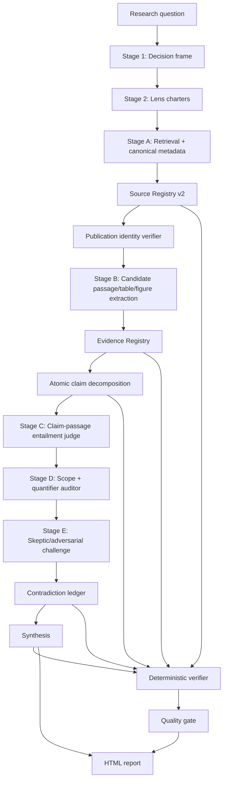

# Storm Council — Publication & Content Verification Audit

> Historical snapshot, not the current product contract. This audit was written
> before later verification, metadata adapter, benchmark, provenance, and recheck
> work landed. Use `docs/CLAIMS_VS_IMPLEMENTATION.md` and
> `docs/DOCUMENTATION_ALIGNMENT_REPORT.md` for current release-audit wording.

> Repo-specific audit produced by applying
> `.superpowers/prompts/storm-council-publication-content-verification-audit-prompt.md`
> to the current repository. No source files were changed to produce this audit.
> Date: 2026-06-30.

## Checks run

```bash
python3 -m pytest tests/
# failed: pytest not installed in this environment

python3 -m unittest discover -s tests
# 21 tests OK

python3 scripts/verify.py examples/network_flow_rl --strict
# PASS_WITH_CAVEATS; coverage 100, traceability 100,
# contradiction-handling 40, recommendation-support 100
```

A temporary negative-control fixture was also created: a fabricated/wrong paper
URL, no evidence locator, and an over-strong `supported` claim
("proves superior on all benchmarks"). `verify.py` returned **PASS**. This
demonstrates that the current quality gate performs mostly structural integrity
checking, not epistemic verification.

---

## 1. Executive audit

**Verdict:** Storm Council's current architecture provides a good *traceability
and contradiction-aware workflow* skeleton, but it does not yet reliably answer
"does this paper exist, does this source actually support this claim, does the
claim exceed the source's scope?" The system currently **encourages**
evidence-grounded behavior through prompts but does not deterministically
**enforce** it.

### Strengths

- `skills/storm-council/SKILL.md` defines a clear six-stage, bounded council
  workflow.
- Factual claims must carry a source ID: `skills/storm-council/SKILL.md:104-116`.
- "Never fake retrieval" rule exists: `skills/storm-council/SKILL.md:221-226`.
- Honesty rule for the status banner (green/PASS only if retrieval/verification
  actually happened): `skills/storm-council/SKILL.md:199-202`.
- `verify.py` computes scores independently of the model: `scripts/verify.py:66-182`.
- The renderer carries the claim ledger, source map, contradiction details, and
  review output into a self-contained HTML report: `scripts/render_report.py:743-781`,
  `1046-1315`.

### Core weakness

The current system does not distinguish:

1. a source ID exists,
2. a URL exists,
3. the paper actually exists,
4. the metadata is correct,
5. the full text was accessed,
6. an exact passage / table / figure supports the specific claim,
7. the claim does not exceed the source's scope.

Today `verify.py` operates at roughly "do claim IDs and source IDs link?" level.
That is **structural verification**. Publication identity verification, content
verification, claim entailment verification, and scope verification are absent.

---

## 2. Architecture gaps — severity-ranked

### Critical

#### C1 — No claim-to-source entailment model

**Where:** `skills/storm-council/templates/claim_record.json:1-12`,
`skills/storm-council/prompts/stage3_evidence_inquiry.md:23-45`.

The current claim schema cannot say:

- Which page? Which section? Which paragraph?
- Which table / figure / equation?
- What is the exact excerpt?
- Does the source directly support the claim, or is it only topic-relevant?
- Does the claim expand the source's scope?

**Risk:** A real but irrelevant or only partially relevant paper can look like
strong claim support.

#### C2 — No publication identity verification fields

**Where:** `skills/storm-council/templates/source_record.json:1-10`,
`examples/network_flow_rl/03_source_registry.csv:1-9`.

Missing critical fields: DOI (raw/normalized), arXiv ID, PMID/PMCID, OpenAlex ID,
Semantic Scholar ID, Crossref work / publisher landing page, version status
(publisher / preprint / accepted manuscript), retraction/correction/superseded
status, duplicate canonical linkage, metadata consistency score, full-text
availability, abstract-only marker.

**Risk:** The system cannot distinguish a valid DOI from a malformed DOI, a
preprint from a publisher version, or a retracted paper from a corrected paper.

#### C3 — `verify.py` does not check epistemic validity

**Where:** `scripts/verify.py:71-168`.

Missing checks: DOI normalize/validate, duplicate DOI, retraction/correction,
full-text vs abstract-only, evidence-locator requirement, excerpt requirement for
direct support, metric/baseline/dataset/scope for comparative claims, overclaiming
language, and whether synthesis claims exceed source scope.

The negative-control fixture (a fabricated `peer_reviewed` source plus a
"proves superior on all benchmarks" claim) returned **PASS**, directly proving C3.

#### C4 — Semantic Scholar is positioned too centrally

**Where:** `skills/storm-council/SKILL.md:228-250`, `agents/academic.md:23-36`.

Semantic Scholar is described as the academic retrieval default and
`externalIds` is used as the stable URL, but there is no canonical metadata
confirmation via publisher / DOI resolver / Crossref / OpenAlex.

**Risk:** A Semantic Scholar record can be treated as bibliographic truth.
Semantic Scholar alone is not a sufficient source hierarchy for the publication
verification the prompt targets.

### High

#### H1 — Prompt/template/schema drift

- Template claim fields are `perspective` and `claim_text`:
  `skills/storm-council/templates/claim_record.json:3-4`.
- Stage 3 prompt fields are `lens` and `statement`:
  `skills/storm-council/prompts/stage3_evidence_inquiry.md:26-29`.
- Contradiction template uses `conflict_id`, `claim_a_id`, `claim_b_id`:
  `skills/storm-council/templates/contradiction_record.json:2-5`.
- Stage 4 prompt uses `contradiction_id`, `claim_ids`:
  `skills/storm-council/prompts/stage4_contradiction_ledger.md:17-23`.
- `verify.py` only expects `claim_a_id` / `claim_b_id`: `scripts/verify.py:84-87`.

**Risk:** If the model follows the prompt and emits different field names, the
validator can produce false fails or false passes.

#### H2 — Scope preservation is prose-only

`limitations` exists but is unstructured: `claim_record.json:10`. Missing scope
fields: dataset/benchmark, population/domain, baseline, metric, time horizon,
deployment vs simulation, statistical/practical significance, conditions,
author-stated caveats.

**Risk:** `some -> all`, `simulation -> deployment`, `associated with -> causes`,
`metric A better -> overall superior` shifts can happen silently in synthesis.

#### H3 — The renderer does not show evidence locators

**Where:** `scripts/render_report.py:743-781`, `1251-1293`.

The HTML report shows claim/source IDs but not the exact supporting passage /
table / figure / page. For a publication-level audit trail, the reader can only
answer "where did this claim come from?" at source-ID granularity.

#### H4 — Example status can look authoritative by hand

`examples/network_flow_rl/report_data.json` sets `status.level = source_checked`
and "Live source lookup used", but `verify.py` does not validate this; it only
patches scores into `report_data.json`: `scripts/verify.py:205-216`.

**Risk:** The report banner can say "source checked" without any deterministic
evidence log.

### Medium

#### M1 — README "Verified independently" is too broad

**Where:** `README.md:42`. A more accurate phrasing is "reference integrity and
structural quality are verified independently." Publication identity and claim
entailment are not verified.

#### M2 — Tests do not cover `verify.py`

`tests/test_render_report.py` is essentially renderer tests. There are no
adversarial tests for `verify.py`.

#### M3 — Example/documentation path drift

`README.md:133` and `docs/examples.md:1-5` reference
`examples/university_timetabling`; the committed example in the repo is
`examples/network_flow_rl/`. Not central to this audit, but a low/medium quality
signal for public-release trust.

### Low

#### L1 — `.DS_Store` and `__pycache__` files are present

Not related to the evidence model, but plugin packaging hygiene should clean
these up.

---

## 3. Verification taxonomy: present vs missing

| Verification type | Current state | Note |
|---|---:|---|
| Structural verification | Partial | ID links, source existence, recommendation refs |
| Metadata verification | Missing | No DOI/title/author/year/venue consistency |
| Content verification | Missing | No full text / excerpt / locator |
| Claim entailment verification | Missing | Whether the source supports the claim is unknown |
| Scope verification | Missing | No dataset, metric, baseline, simulation/deployment drift |
| Source-quality assessment | Very limited | `source_type` plus string-heuristic notes |

---

## 4. Proposed evidence-verification architecture



### Role separation

- **Retriever / Metadata verifier** — finds sources, resolves canonical metadata
  via hierarchy, never decides claim support.
- **Extractor** — finds candidate passages, figures, tables, equations; emits
  locators and excerpts; never decides final support strength.
- **Judge** — decides `direct_support`, `partial_support`, `contradiction`,
  `out_of_scope`, `not_verifiable`.
- **Scope auditor** — checks dataset, benchmark, population, baseline, metric,
  time horizon, deployment/simulation, limitations.
- **Skeptic lens** — challenges overclaiming, secondary citations, benchmark
  generalization, and abstract-only support.
- **Deterministic verifier** — enforces schema, IDs, locator rules, DOI format,
  duplicate IDs, abstract-only gating, retraction flags, and consistency; does
  **not** pretend to solve semantic entailment.

---

## 5. Schema changes

### 5.1 Source record v2

Replace or extend `skills/storm-council/templates/source_record.json`.

```json
{
  "source_id": "S-001",
  "title": "Exact title",
  "authors": ["Surname, Given"],
  "year": 2023,
  "venue": "ACM SIGCOMM",
  "publisher": "ACM",
  "source_type": "peer_reviewed",
  "url": "https://...",
  "identifiers": {
    "doi_raw": "10.xxxx/xxxxx",
    "doi_normalized": "10.xxxx/xxxxx",
    "arxiv_id": null,
    "pmid": null,
    "pmcid": null,
    "openalex_id": null,
    "semantic_scholar_id": null,
    "crossref_work_id": null,
    "publisher_landing_page": null
  },
  "publication_identity": {
    "status": "PUBLISHED_VERIFIED",
    "version": "publisher_version",
    "metadata_sources_checked": ["publisher", "crossref", "openalex"],
    "metadata_consistency_score": 0.96,
    "metadata_mismatches": [],
    "duplicate_of": null,
    "related_versions": ["S-004A"],
    "retraction_status": "not_retracted",
    "correction_status": "none",
    "superseded_by": null
  },
  "access": {
    "full_text_status": "FULL_TEXT_AVAILABLE",
    "accessed_at": "2026-06-30T00:00:00+03:00",
    "retrieval_method": "publisher|crossref|openalex|semantic_scholar|manual|web",
    "retrieval_log_id": "R-001"
  },
  "credibility_notes": "Why credible for this topic.",
  "relevance_notes": "Why relevant, not why it entails a claim."
}
```

### 5.2 Evidence record — new template

Create `skills/storm-council/templates/evidence_record.json`.

```json
{
  "evidence_id": "E-001",
  "source_id": "S-001",
  "locator": {
    "page": 7,
    "section": "4.2",
    "subsection": null,
    "table": "Table 2",
    "figure": null,
    "equation": null,
    "paragraph_hint": "paragraph beginning 'On the Abilene topology...'"
  },
  "evidence_excerpt": "Short quoted or extracted passage.",
  "extraction_method": "full_text|abstract|metadata|manual",
  "extracted_by": "academic",
  "supports_candidate_claims": ["C-001"],
  "notes": "Candidate passage only; entailment decided separately."
}
```

### 5.3 Claim record v2

Extend `skills/storm-council/templates/claim_record.json`.

```json
{
  "claim_id": "C-001",
  "perspective": "academic",
  "claim_text": "Atomic claim text.",
  "atomicity": {
    "is_atomic": true,
    "split_from": null,
    "bundled_risk": []
  },
  "claim_type": "fact",
  "claim_strength": "descriptive|comparative|causal|quantitative|recommendation",
  "confidence": 0.72,
  "evidence_status": "supported",
  "source_ids": ["S-001"],
  "evidence_ids": ["E-001"],
  "content_verification": {
    "status": "direct_support",
    "full_text_status": "full_text",
    "evidence_locator_required": true,
    "entailment_rationale": "The table reports metric X on benchmark Y versus baseline Z.",
    "adversarial_check": "passed"
  },
  "support_scope": {
    "population_or_domain": "traffic engineering",
    "dataset_or_benchmark": "Abilene topology replay",
    "conditions": "simulation using traffic matrix set X",
    "comparison_baseline": "LP-based traffic engineering optimizer",
    "metric": "max link utilization",
    "time_horizon": "offline evaluation",
    "deployment_context": "simulation",
    "statistical_significance": null,
    "practical_significance": "reported improvement but production impact unknown",
    "limitations": ["Does not establish production deployment safety."]
  },
  "scope_risk_flags": ["simulation_to_deployment_risk"],
  "counterevidence_ids": ["C-011"],
  "created_at": "2026-06-30T00:00:00+03:00"
}
```

### 5.4 New verification statuses

Use in source registry and quality scoring:

```text
PUBLISHED_VERIFIED
PREPRINT_VERIFIED
METADATA_PARTIAL
ABSTRACT_ONLY
FULL_TEXT_AVAILABLE
FULL_TEXT_UNAVAILABLE
RETRACTED
CORRECTED
SUPERSEDED
DUPLICATE_VERSION
UNRESOLVED
```

Recommended mapping:

- `RETRACTED` -> claim cannot be `direct_support`.
- `ABSTRACT_ONLY` -> cannot support strong empirical / causal / comparative /
  quantitative claims.
- `METADATA_PARTIAL` -> max claim support is `partial_support`.
- `DUPLICATE_VERSION` -> canonical source must be used or linked.
- `CORRECTED` / `SUPERSEDED` -> visible warning in report and lower score.

---

## 6. File-by-file implementation plan

| Priority | File path | Why change | Exact fields / logic | Backward compatibility | Validation | Tests |
|---:|---|---|---|---|---|---|
| P0 | `skills/storm-council/templates/source_record.json` | Source identity is under-specified | Add `identifiers`, `publication_identity`, `access` | Keep old flat fields accepted; normalize into v2 internally | DOI format, duplicate DOI, version status enum, retraction status enum | `test_source_v2_accepts_identifiers`, `test_duplicate_doi_blocks_pass` |
| P0 | `skills/storm-council/templates/claim_record.json` | Claim support lacks exact evidence | Add `evidence_ids`, `content_verification`, `support_scope`, `claim_strength`, `atomicity` | Old records allowed but downgraded unless evidence locator exists | Supported/direct claims require evidence IDs and locator | `test_direct_support_requires_locator` |
| P0 | create `skills/storm-council/templates/evidence_record.json` | Need source passage/table/figure as first-class object | Add evidence ID, locator, excerpt, extraction method | Optional in v1, required for v2 direct support | Evidence IDs resolve to source IDs; locator present | `test_evidence_id_links_to_existing_source` |
| P0 | `skills/storm-council/prompts/stage3_evidence_inquiry.md` | Stage 3 is where citation laundering starts | Require atomic claims, evidence registry, no abstract-only strong support, source identity status | Allow legacy `03_claims.jsonl`; add `03_evidence.jsonl` | Prompt output must use v2 shape | Golden prompt fixture |
| P0 | `scripts/verify.py` | Current validator passes epistemically invalid fixtures | Add v2 schema checks, DOI normalization, abstract-only gating, locator checks, overclaim lexicon | Parse old fields; emit warnings/downgrade scores, not crash | Deterministic checks listed below | New `tests/test_verify.py` |
| P1 | `skills/storm-council/prompts/stage4_contradiction_ledger.md` | Contradiction ledger needs source-scope conflicts | Add `scope_conflict`, `evidence_conflict`, `version_conflict`, canonical `claim_ids` shape | Support old `claim_a_id`/`claim_b_id` via migration | All claim IDs valid; contradiction references evidence where applicable | `test_contradiction_claim_ids_valid` |
| P1 | `skills/storm-council/prompts/stage5_synthesis.md` | Synthesis can silently overgeneralize | Require scope-preservation audit before headline findings | Old synthesis still renders | Flag forbidden upgrades: some->all, simulation->deployment, associated->causes | `test_synthesis_overclaiming_language_flagged` |
| P1 | `skills/storm-council/prompts/stage6_adversarial_review.md` | Review currently prompt-level only | Require weakest claim by entailment, abstract-only warnings, source-version warnings | Old review optional | verify.py remains source of deterministic gate | Golden adversarial review fixture |
| P1 | `agents/academic.md` | Academic lens over-relies on Semantic Scholar | Add canonical metadata hierarchy: publisher/DOI resolver, Crossref, OpenAlex, Semantic Scholar as discovery | Existing instructions preserved but downgraded | Must record metadata source checked | Agent prompt snapshot test |
| P1 | `agents/skeptic.md` | Skeptic should attack entailment and scope | Add checklist: exact locator, abstract-only, metric drift, benchmark generalization, secondary citation | No schema break | Skeptic move can target evidence ID | Fixture with wrong metric |
| P1 | `docs/methodology.md` | Methodology must distinguish traceability vs verification | Add section "Publication identity vs claim entailment" | Additive | Docs grep for required terms | Docs test |
| P1 | `docs/claim-traceability.md` | Current doc says supported means backed by source, too broad | Define direct/partial/indirect/contradiction/out-of-scope | Additive | Ensure README links | Docs test |
| P1 | `README.md` | Public claims overstate current independent verification | Clarify structural vs metadata/content verification | Add "verification levels" table | Docs grep | Docs test |
| P2 | `scripts/render_report.py` | Report must expose evidence locators and source warnings | Render evidence excerpts, locators, version status, abstract-only badges | If absent, current display unchanged | HTML contains locator for direct support | Renderer tests |
| P2 | `examples/network_flow_rl/*` | Example lacks v2 evidence objects | Regenerate or hand-upgrade example artifacts with evidence locators and status caveats | Keep v1 example in archive if desired | verify.py should return PASS_WITH_CAVEATS only with evidence | Example verification test |
| P2 | `docs/examples.md` | Example path stale | Update to `examples/network_flow_rl/` or restore missing university example | Additive | Link/path existence check | `test_docs_example_paths_exist` |
| P3 | `.gitignore` / cleanup | `.DS_Store`, `__pycache__` noise | Ignore and remove from tracking if tracked | No behavior change | `git ls-files` check | Repo hygiene test |

---

## 7. `verify.py` enhancement plan

### Deterministic checks (pure local, no network/LLM)

1. **ID format and uniqueness** — `C-\d{3,}`, `S-\d{3,}`, `E-\d{3,}`, `X-\d{3,}`;
   duplicate IDs block.
2. **Source existence** — every supported/partially-supported claim's
   `source_ids` resolve; every `evidence_id` resolves; every evidence source
   resolves.
3. **DOI normalization** — normalize `https://doi.org/10.x` and `doi:10.x` to
   `10.x`; malformed DOI -> major/blocking by source status; duplicate DOI ->
   duplicate version warning/block.
4. **Version status** — enum check; `RETRACTED` cannot support claims;
   `CORRECTED`/`SUPERSEDED` requires visible warning.
5. **Evidence locator requirement** — `content_verification.status ==
   direct_support` requires at least one of: page + section, table, figure,
   equation, paragraph_hint, official clause.
6. **Abstract-only gating** — if `full_text_status == abstract_only`, claim cannot
   be causal, strong quantitative, comparative superiority, safety-critical, or
   use best/superior/proves/always/all language.
7. **Scope fields for comparative claims** — comparative claims (or "better than",
   "outperforms", "faster than") require `dataset_or_benchmark`,
   `comparison_baseline`, `metric`, `conditions`.
8. **Overclaim lexicon** — flag unsupported strong terms: `all`, `always`,
   `proves`, `causes`, `best`, `superior`, `guarantees`, `will`, especially with
   partial/abstract-only evidence.
9. **Contradiction validity** — contradictions reference valid claim IDs;
   `scope_difference` names the scope dimension; `evidence_gap` names the decisive
   missing evidence.
10. **Status banner honesty** — `status.level in {source_checked, verified, pass}`
    requires a `verification_log` or metadata-check artifacts; otherwise downgrade
    to `ILLUSTRATIVE` / `UNVERIFIED`.
11. **Report-data consistency** — `strongest_findings[].claims` resolve;
    findings cannot cite only unsupported claims; recommendations distinguish
    evidence from judgment.

### Metadata checks (deterministic with adapters, not pure local)

Optional adapters with cached outputs: DOI resolver / publisher page, Crossref,
OpenAlex, PubMed/PMC, arXiv version check, retraction/correction lookups.

```text
scripts/metadata_adapters/
  crossref.py
  openalex.py
  doi.py
  arxiv.py
  pubmed.py
```

Each writes a local `metadata_verification.jsonl`; `verify.py` consumes it
deterministically.

### LLM-assisted checks (do not pretend deterministic)

- Claim atomicity judgement.
- Passage-to-claim entailment.
- Scope/quantifier drift beyond lexicon heuristics.
- "Statistically significant but practically trivial" judgement.
- Whether a secondary citation is used instead of primary evidence.
- Whether synthesis overstates author caveats.

Recommended output: `llm_audit_findings.jsonl`, then `verify.py` checks that these
findings are resolved or carried into warnings.

---

## 8. Test strategy

Add `tests/test_verify.py` plus fixtures under `tests/fixtures/verify/`.

### Required adversarial tests

| Case | Fixture | Expected |
|---|---|---|
| Real paper, wrong claim | `real_paper_wrong_claim/` | LLM-assisted entailment blocks direct support; deterministic requires locator |
| Correct topic, wrong metric | `wrong_metric/` | comparative claim requires metric and baseline; scope flag |
| Correct result, wrong benchmark generalization | `benchmark_generalization/` | overclaim warning/block |
| Abstract loosely supports, full text contradicts | `abstract_fulltext_conflict/` | abstract-only cannot be direct support |
| Preprint later contradicted by journal version | `preprint_superseded/` | source status `SUPERSEDED`; block direct support |
| Retracted paper cited | `retracted_source/` | blocking issue |
| Same paper as DOI/arXiv/Semantic Scholar | `duplicate_versions/` | duplicate canonicalization warning/block |
| Secondary citation instead of primary | `secondary_citation/` | warning requiring primary source |
| Statistically significant but practically trivial | `stat_practical_gap/` | scope/practical-significance flag |
| "Improved average" -> "best overall" | `average_to_best_overall/` | overclaim block |
| Simulation -> deployment | `simulation_to_deployment/` | scope expansion block |
| Association -> causation | `association_to_causation/` | causal overclaim block |

### Minimal fixture example

`tests/fixtures/verify/direct_support_no_locator/03_claims.jsonl`:

```json
{"claim_id":"C-001","perspective":"academic","claim_text":"Method X is superior on all benchmarks.","claim_type":"fact","claim_strength":"comparative","confidence":0.95,"evidence_status":"supported","source_ids":["S-001"],"evidence_ids":["E-001"],"content_verification":{"status":"direct_support","full_text_status":"full_text"},"support_scope":{}}
```

`tests/fixtures/verify/direct_support_no_locator/03_evidence.jsonl`:

```json
{"evidence_id":"E-001","source_id":"S-001","locator":{},"evidence_excerpt":"The method improves average score on Benchmark A."}
```

Expected:

```text
REVISE or BLOCKED_PENDING_EVIDENCE
blocking: direct_support requires evidence locator
major: comparative claim missing metric/baseline/dataset
major: overclaiming language: all/superior
```

---

## 9. Suggested README changes

### Narrow the current "Verified independently"

`README.md:42` is structurally true but publication-level readers may read it as
content verification. Suggested replacement:

```markdown
- **Verified structurally, not magically.** `verify.py` independently checks
  artifact integrity: claim/source IDs resolve, supported facts cite registered
  sources, contradictions reference real claims, and recommendations point back
  to evidence. This is not the same as proving that a paper exists, that a paper
  supports a claim, or that a synthesis preserves the paper's scope. Runs that
  include publication metadata checks or full-text claim verification must mark
  those verification levels explicitly.
```

### Add a "Verification levels" section

```markdown
## Verification levels

Storm Council distinguishes four levels:

1. **Traceable** - claim IDs and source IDs are linked.
2. **Publication-verified** - DOI/publisher/Crossref/OpenAlex or domain index
   metadata confirms the source identity and version status.
3. **Content-verified** - the output records an exact page, section, table,
   figure, equation, paragraph, or standard clause supporting the claim.
4. **Scope-audited** - the synthesis preserves population, benchmark, baseline,
   metric, conditions, time horizon, deployment context, limitations, and caveats.

A citation is not proof by itself. A source can be real and relevant while still
not supporting the specific claim.
```

### Add the abstract-only rule

```markdown
A title or abstract can support discovery and weak relevance notes, but it cannot
support strong empirical, causal, comparative, safety-critical, or quantitative
claims. Abstract-only support must be marked `abstract_consistent_only` or
`partial_support`, never `direct_support`.
```

### Fix the stale example path

Update `README.md:133` and `docs/examples.md:1-5` to point at the actual committed
example, or restore the missing `examples/university_timetabling/` directory.

---

## 10. Minimal viable implementation roadmap

### Phase 1 — Schema and prompt changes

Make weak evidence impossible to represent as strong evidence without missing
fields being visible.

- Add v2 source, claim, evidence templates.
- Add `03_evidence.jsonl` artifact.
- Update Stage 3 prompt for atomic claims and exact locators.
- Update Stage 4 prompt for scope/evidence conflicts.
- Update Stage 5 prompt for scope-preserving synthesis.
- Update Stage 6 prompt for publication/content verification audit.
- Update agents, especially academic and skeptic.

Exit criteria: existing example still renders; a new fixture with direct support
but no locator fails validation.

### Phase 2 — Deterministic validator

Make `verify.py` block obvious laundering and overclaiming (checks in Section 7).

Exit criteria: the negative control that currently passes now returns `REVISE` or
`BLOCKED_PENDING_EVIDENCE`; `python3 -m unittest discover -s tests` passes; the
expected `verify.py examples/network_flow_rl --strict` result is documented.

### Phase 3 — Metadata API adapters

Verify publication identity separately from claim support.

- DOI resolver / publisher landing page.
- Crossref.
- OpenAlex.
- Semantic Scholar as discovery/citation graph, not sole truth.
- Domain-specific later: PubMed, arXiv, IEEE, ACM, SSRN/NBER/RePEc, standards.

Outputs: `metadata_verification.jsonl`, `source_versions.jsonl`,
`retrieval_log.jsonl`.

Exit criteria: same DOI under arXiv/Semantic Scholar/publisher collapses to a
canonical source; retracted/corrected/superseded flags flow into `verify.py`.

### Phase 4 — Content verification and skeptic audit

Verify "this passage supports this atomic claim."

- Extractor prompt for candidate passages/tables/figures.
- Entailment judge prompt.
- Scope auditor prompt.
- Skeptic challenge prompt targeting evidence IDs.
- Report rendering for evidence locators and excerpts.

Exit criteria: wrong-paper/wrong-claim, correct-topic/wrong-metric,
simulation-to-deployment, and association-to-causation fixtures are caught.

### Phase 5 — Benchmark and evaluation

Measure whether Storm Council is harder to fool.

Build an adversarial fixture suite covering the 12 prompt cases. Track: false
pass rate, false block rate, missing locator rate, source identity mismatch
detection, overclaim detection, abstract-only downgrade accuracy, contradiction
carry-through rate.

Exit criteria: public example includes v2 artifacts; README explains exactly what
is verified and what remains human/domain-expert review; no green
"verified/source checked" banner without verification logs.

---

## Bottom line

Storm Council already has a strong contradiction-aware workflow skeleton. The main
publication-level gap is that **source traceability is treated as if it were close
to evidence verification**. To make it materially harder to fool, the repo needs a
first-class separation between:

```text
source exists
source metadata is canonical
source full text was inspected
specific evidence supports an atomic claim
claim preserves the source's scope
synthesis preserves contradictions and limitations
```

The fastest useful upgrade is **Phase 1 + Phase 2**: add evidence locators/scope
fields, then make `verify.py` fail direct-support claims without them. That alone
would eliminate the most dangerous current failure mode: a real or plausible
source ID laundering an unsupported, over-broad claim.
