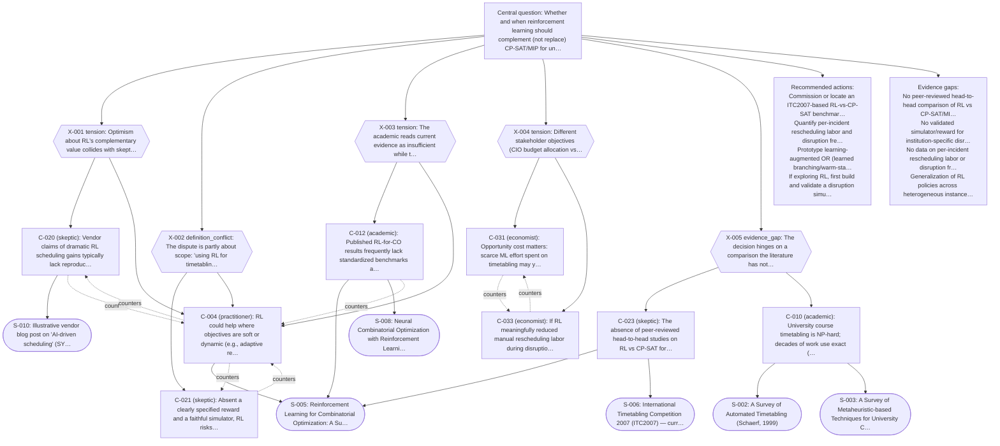

# 05 · Source-Mapped Synthesis

> ⚠️ **Mock run — not live retrieval.** Generated by Storm Council using the `mock` adapter at 2026-01-01T00:00:00+00:00. The sources below are illustrative (and one, S-010, is explicitly synthetic). Verify every source independently before relying on anything here.

## 1. Executive summary
On current evidence, reinforcement learning should not replace CP-SAT/MIP for university course timetabling. Exact and metaheuristic methods reliably satisfy hard constraints and produce auditable schedules, whereas RL's demonstrated strengths in combinatorial optimization come mostly from routing/packing studies and rarely beat strong OR baselines on constrained scheduling. RL's plausible near-term role is narrow: augmenting soft or dynamic objectives (e.g., disruption rescheduling), and only where a validated simulator/reward and a reproducible baseline exist - neither of which the literature currently provides for this domain. The decision is therefore inconclusive in RL's favour: the recommended path is to keep solver-based timetabling, optionally pilot learning-augmented OR, and commission the missing benchmark before any RL investment.

## 2. Decision context
Whether and when reinforcement learning should complement (not replace) CP-SAT/MIP for university course timetabling.

## 3. Strongest evidence-backed findings
- University course timetabling is NP-hard but routinely solved to feasibility/optimality by CP-SAT/MIP and metaheuristics (C-010, C-001).
- Published RL-for-combinatorial-optimization gains concentrate on routing/packing and seldom outperform strong OR baselines on constrained scheduling (C-011, C-012).
- Historically, each new 'autonomous' scheduling wave over-promised and settled into niche or hybrid use (C-040, C-041).
- RL solutions lack the optimality guarantees and explainability that student-facing decisions often require (C-022).

## 4. Main disagreements and why they remain unresolved
- [X-001] Whether reported RL gains are reproducible enough to expect complementary value (skeptic vs practitioner) - unresolved, evidence insufficient.
- [X-002] Scope/definition: 'use RL for timetabling' = replace the solver vs augment soft/dynamic objectives - partially resolved by scoping to augmentation.
- [X-003] Time horizon: current evidence (insufficient) vs near-term pilot potential - partially resolved via a pre-registered pilot.
- [X-004] Stakeholder objectives: ML budget opportunity cost vs operational resilience value - unresolved, needs labor-cost data.
- [X-005] Evidence gap: no peer-reviewed RL-vs-CP-SAT head-to-head for this domain - unresolved.

## 5. Confidence-ranked claims
- **C-010** (conf 0.90 · supported): University course timetabling is NP-hard; decades of work use exact (ILP/CP) and metaheuristic methods with strong benchmark results.
- **C-001** (conf 0.85 · supported): Production university timetabling is routinely solved to feasibility/optimality by constraint solvers such as OR-Tools CP-SAT, which encode hard constraints declaratively.
- **C-040** (conf 0.70 · supported): Timetabling has cycled through expert systems, genetic algorithms, simulated annealing, tabu search, and hyper-heuristics; each wave over-promised general autonomy and settled into niche use.
- **C-020** (conf 0.70 · contested): Vendor claims of dramatic RL scheduling gains typically lack reproducible baselines and may reflect selection or marketing bias.
- **C-002** (conf 0.70 · partially_supported): CP-SAT/MIP produce auditable, constraint-guaranteed schedules, which matters for stakeholder trust and handling appeals.
- **C-022** (conf 0.60 · partially_supported): Even where RL learns good policies, the lack of optimality guarantees and explainability is a governance problem for student-facing decisions.
- **C-011** (conf 0.65 · partially_supported): RL for combinatorial optimization has shown promise mainly on routing/packing in controlled studies, often learning heuristics rather than guaranteeing optimality.
- **C-041** (conf 0.60 · partially_supported): Methods that won competitions did not always displace solver/manual hybrids in practice, owing to integration and trust gaps.
- **C-043** (conf 0.60 · partially_supported): The durable pattern is hybridization — learning components feeding exact solvers rather than replacing them — suggesting RL's realistic role is augmentation.
- **C-014** (conf 0.60 · partially_supported): RL methods can struggle to generalize across problem-size and distribution shifts, a concern for heterogeneous university instances.
- **C-030** (conf 0.60 · partially_supported): Total cost of ownership for an RL approach (data pipelines, simulation, ML staff, monitoring) likely exceeds a CP-SAT deployment for comparable quality at most universities.
- **C-013** (conf 0.55 · partially_supported): Learning-augmented OR (e.g., learned branching, warm-starts) is a more evidence-backed near-term path than end-to-end RL timetabling.
- **C-032** (conf 0.55 · partially_supported): Switching costs and procurement inertia favor incumbent solver-based systems; adoption friction is an economic, not only technical, barrier.
- **C-012** (conf 0.55 · contested): Published RL-for-CO results frequently lack standardized benchmarks and rarely beat strong OR baselines on constrained scheduling.
- **C-021** (conf 0.60 · unsupported): Absent a clearly specified reward and a faithful simulator, RL risks optimizing proxy objectives that diverge from stakeholder goals.
- **C-003** (conf 0.55 · unsupported): Most timetabling teams lack the ML engineering capacity to train, monitor, and maintain an RL controller in production.
- **C-023** (conf 0.55 · partially_supported): The absence of peer-reviewed head-to-head studies on RL vs CP-SAT for university timetabling signals immaturity, not hidden success.
- **C-042** (conf 0.55 · unsupported): Enthusiasm for new methods (now RL/LLMs) tends to underestimate the maintenance and institutional-trust burden that sank earlier 'autonomous' scheduling efforts.
- **C-031** (conf 0.50 · unsupported): Opportunity cost matters: scarce ML effort spent on timetabling may yield more value applied to demand forecasting or room-utilization analytics.
- **C-033** (conf 0.50 · contested): If RL meaningfully reduced manual rescheduling labor during disruptions, it could pay off in large, volatile institutions.
- **C-004** (conf 0.50 · partially_supported): RL could help where objectives are soft or dynamic (e.g., adaptive rescheduling after disruptions) as a complement to, not a replacement for, exact solvers.

## 6. Evidence gaps
- No peer-reviewed head-to-head comparison of RL vs CP-SAT/MIP on university course timetabling (X-005).
- No validated simulator/reward for institution-specific disruption dynamics (X-001).
- No data on per-incident rescheduling labor or disruption frequency by institution type (X-004).
- Generalization of RL policies across heterogeneous instance sizes is untested for this domain (C-014).

## 7. Decision options and trade-offs

### A. Keep CP-SAT/MIP as primary; no RL  ·  evidence: _Strong_
Continue solving timetabling with exact/metaheuristic methods.

**Pros**
- Proven feasibility/optimality
- Auditable schedules
- Lowest total cost of ownership
- Fits existing staffing

**Cons**
- Limited adaptivity to soft or dynamic objectives

**When appropriate:** Most universities with stable, constraint-heavy schedules.

### B. CP-SAT/MIP primary + pilot learning-augmented OR  ·  evidence: _Moderate_
Keep the solver of record; pilot learned branching/warm-starts feeding it.

**Pros**
- Keeps optimality guarantees
- Evidence-backed direction (S-004)
- Incremental and reversible

**Cons**
- Engineering effort
- Uncertain marginal gains
- Needs ML capacity

**When appropriate:** Large institutions with ML capacity seeking efficiency gains.

### C. Add an RL layer for dynamic rescheduling only (guarded pilot)  ·  evidence: _Weak / speculative_
Use RL solely for disruption rescheduling on top of the solver.

**Pros**
- Potential labor savings during disruptions

**Cons**
- Requires a validated simulator/reward
- Governance/explainability risk
- No domain benchmark exists

**When appropriate:** Only as a pre-registered pilot with a CP-SAT baseline and human oversight.

### D. Replace the solver with end-to-end RL  ·  evidence: _Unsupported_
Drop exact solvers in favour of a learned policy.

**Pros**
_none identified_

**Cons**
- No optimality guarantee
- No domain evidence
- High operational and trust risk

**When appropriate:** Not recommended on current evidence.

## 8. Recommended next actions
- Commission or locate an ITC2007-based RL-vs-CP-SAT benchmark before any RL investment (addresses X-005).
- Quantify per-incident rescheduling labor and disruption frequency by institution type (addresses X-004).
- Prototype learning-augmented OR (learned branching/warm-starts) feeding CP-SAT (Option B).
- If exploring RL, first build and validate a disruption simulator and reward, with explicit governance for student-facing automation (precondition for Option C).
- Keep CP-SAT/MIP as the system of record throughout.

## 9. Frontier questions
- Can learned components reliably warm-start or guide CP-SAT at university scale?
- Is a faithful, validated disruption simulator achievable for a given institution?
- What reward formulation avoids optimizing proxy objectives that diverge from stakeholder goals?
- Under what disruption frequency does an RL rescheduling layer become cost-justified?

## 10. Source map

- **S-001** (industry) — cited by: C-001, C-002, C-030
- **S-002** (peer_reviewed) — cited by: C-010, C-040
- **S-003** (peer_reviewed) — cited by: C-010, C-040
- **S-004** (peer_reviewed) — cited by: C-011, C-013, C-043
- **S-005** (peer_reviewed) — cited by: C-004, C-011, C-012, C-022, C-023, C-030, C-043
- **S-006** (standards) — cited by: C-002, C-023
- **S-007** (peer_reviewed) — cited by: C-032, C-041
- **S-008** (other) — cited by: C-012
- **S-009** (peer_reviewed) — cited by: C-014
- **S-010** (blog) — cited by: C-020

### Argument map

